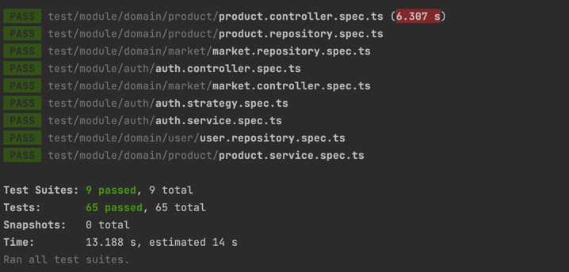

:doctype: book
:icons: font
:source-highlighter: highlightjs
:toc: left
:toclevels: 3
:sectlinks:

== 개요

* 구매자와 셀러의 거래 중계를 위한 서비스

== 개발기간

* 2022.11.7 ~ 2022.11.10

== 기술 스택

* TypeScript, NestJS, MongoDB

== 스키마 설계

=== 유저
* email : 이메일
* name : 유저 이름
* phone : 연락처
* password : 비밀번호
* createAt : 유저 데이터 생성일
* updateAt : 유저 데이터 갱신일

=== 마켓

* name : 마켓명
* email : 마켓 이메일
* phone : 마켓 연락처
* country : 판매 국가
* userId : 유저 참조 ID
* createAt : 마켓 데이터 생성일
* updateAt : 마켓 데이터 갱신일

=== 상품

* name : 상품명
* price : 상품 가격
* stock : 재고
* category : 카테고리
* deadline : 주문 마감일
* userId : 유저 참조 ID
* marketId : 마켓 참조 ID
* createAt : 상품 데이터 생성일
* updateAt : 상품 데이터 갱신일
* deleteAt : 상품 데이터 삭제일

== 구현 기능
=== 회원가입 / 로그인
* 이메일, 이름, 연락처, 비밀번호를 입력하여 회원 가입
* 비밀번호는 최소 하나 이상의 알파벳, 하나 이상의 숫자를 포함한 최소 8자 이상으로 입력
* 이메일과 비밀번호를 입력하여 로그인 처리
* 로그인 성공시 세션을 통해 인증 처리
* 로그아웃시 세션과 쿠키를 제거

=== 마켓 등록
- 마켓 명, 이메일, 연락처, 국가를 입력받아 마켓 정보 등록
- 국가 목록은 enum 으로 관리

=== 상품 등록
- 상품 명, 가격, 재고, 카테고리, 마켓 ID, 주문 마감일 값을 입력 받아 상품 정보 등록
- 마켓을 등록한 셀러가 해당 마켓에 상품 정보를 등록
- 카테고리 목록은 enum 으로 관리

=== 상품 목록 조회
- 카테고리, 국가, 상품명을 통해 검색하여 해당하는 상품 목록을 조회
- 최근에 등록한 순으로 정렬하여 조회

=== 상품 상세 조회
- 상품 ID를 입력받아 해당 상품 명, 가격, 국가, 주문 마감일, 마켓 명, 마켓 이메일, 마켓 연락처를 조회

=== 상품 정보 수정
- 상품을 등록한 셀러는 등록한 상품의 상품 명, 가격, 재고, 카테고리, 주문 마감일 정보를 수정 가능

=== 상품 정보 삭제
- 상품을 등록한 셀러는 해당 상품의 정보를 삭제 가능

== API
=== 유저
- 회원가입
|===
|Method|URL|Request Body|Response|Description
|POST
|/api/auth/signUp
|email : 이메일 +
name : 이름 +
phone : 연락처 +
password : 비밀번호
|statusCode : 201
|유저 인증을 위한 정보를 등록
|===

- 로그인
|===
|Method|URL|Request Body|Response|Description
|POST
|/api/auth/login
|email : 이메일 +
password : 비밀번호
|statusCode : 201
|이메일과 비밀번호를 입력받아 유저 인증 처리
|===

- 로그아웃
|===
|Method|URL|Response|Description
|POST
|/api/auth/logout
|statusCode : 200
|세션에서 사용자 정보를 제거하여 로그아웃 처리
|===

=== 마켓
- 마켓 등록
|===
|Method|URL|Request Body|Response|Description
|POST
|/api/markets
|name : 마켓명 +
email : 이메일 +
phone : 연락처 +
country : 판매국가
|statusCode : 201
|마켓 정보를 입력받아 등록
|===

=== 상품
- 상품 등록
|===
|Method|URL|Request Body|Response|Description
|POST
|/api/products
|name : 상품명 +
price : 상품가격 +
stock : 재고 +
category : 카테고리 +
deadline : 주문 마감일 +
marketId : 마켓 Id
|statusCode : 201
|상품 정보를 입력받아 등록
|===

- 상품 목록 조회
|===
|Method|URL|Request Body|Response|Description
|GET
|/api/products
|country : 국가명 +
category : 카테고리 +
page : 조회 페이지 번호 +
keyword : 검색어
|statusCode : 200 +
products : { +
&nbsp;&nbsp;id : 상품 id +
&nbsp;&nbsp;name : 상품명 +
&nbsp;&nbsp;price : 상품 가격 +
&nbsp;&nbsp;country : 국가명 +
}[]
|국가, 카테고리, 페이지 번호, 검색어를 입력받아 해당하는 상품 목록을 조회
|===

- 상품 상세 조회
|===
|Method|URL|Request Path|Response|Description
|GET
|/api/products/:id
|id : 상품 id
|statusCode : 200 +
product : { +
&nbsp;&nbsp;id : 상품 id +
&nbsp;&nbsp;name : 상품명 +
&nbsp;&nbsp;price : 상품 가격 +
&nbsp;&nbsp;country : 국가명 +
&nbsp;&nbsp;deadline : 주문 마감일 +
&nbsp;&nbsp;market : { +
&nbsp;&nbsp;&nbsp;&nbsp;id : 마켓 id +
&nbsp;&nbsp;&nbsp;&nbsp;name : 마켓명 +
&nbsp;&nbsp;&nbsp;&nbsp;email : 마켓 email +
&nbsp;&nbsp;&nbsp;&nbsp;phone : 마켓 연락처 +
&nbsp;&nbsp;} +
}
|특정 상품에 대한 정보를 상세 조회 +
연관된 마켓 정보를 함께 조회
|===

- 상품 상세 수정
|===
|Method|URL|Request Path|Request Body|Response|Description
|PATCH
|/api/products/:id
|id : 상품 id
|name : 상품명 +
price : 상품가격 +
stock : 재고 +
category : 카테고리 +
deadline : 주문 마감일
|statusCode : 204
|등록되어있는 상품 정보를 수정
|===

- 상품 정보 삭제
|===
|Method|URL|Request Path|Response|Description
|DELETE
|/api/products/:id
|id : 상품 id
|statusCode : 204
|등록되어있는 상품 정보를 SoftDelete 처리
|===

== 테스트

* link:https://github.com/MisterRuby/market/tree/develop/test/module/auth[사용자 인증]
** 회원가입, 로그인, 로그아웃 처리가 정상적으로 동작하는지 확인하기 위한 테스트 코드 작성
** 회원가입시 입력한 값에 대해서 유효성 검증 처리가 작동하는지 확인하기 위한 테스트 코드 작성

* link:https://github.com/MisterRuby/market/tree/develop/test/module/domain/market[마켓]
** 마켓 등록이 정상적으로 동작하는지 확인하기 위한 테스트 코드 작성
** 마켓 등록시 유저의 로그인 상태, 입력 값들의 유효성 검증 처리가 작동하는지 확인하기 위한 테스트 코드 작성

* link:https://github.com/MisterRuby/market/tree/develop/test/module/domain/product[상품]
** 상품 등록, 수정, 조회가 정상적으로 동작하는지 확인하기 위한 테스트 코드 작성
** 상품 등록, 수정, 조회시 입력한 값에 대한 유효성 검증 처리가 작동하는지 확인하기 위한 테스트 코드 작성

=== 테스트 전체 실행 결과

